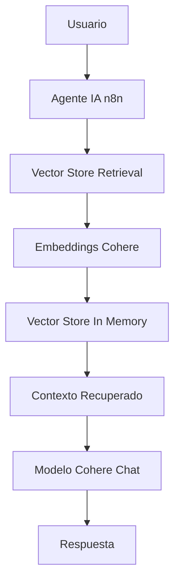
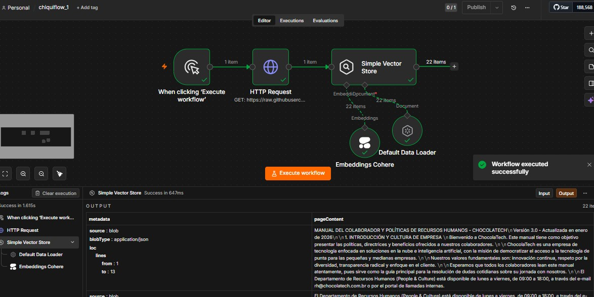
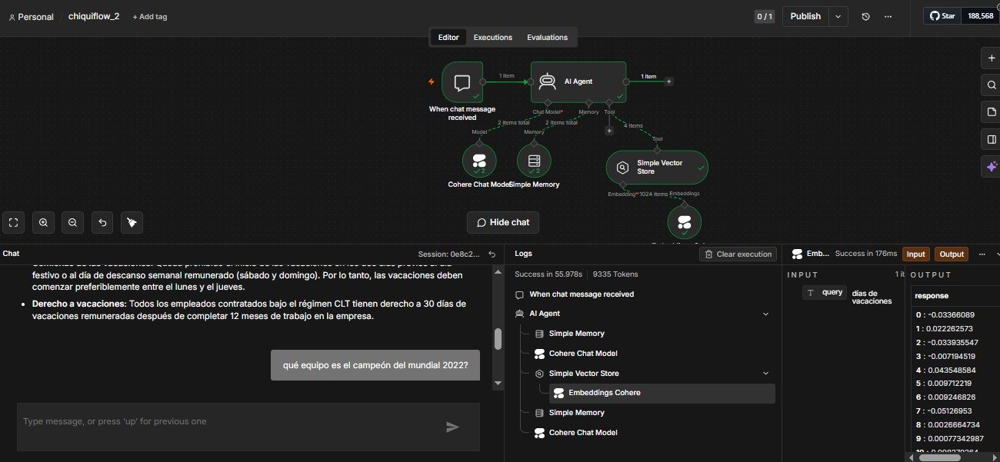
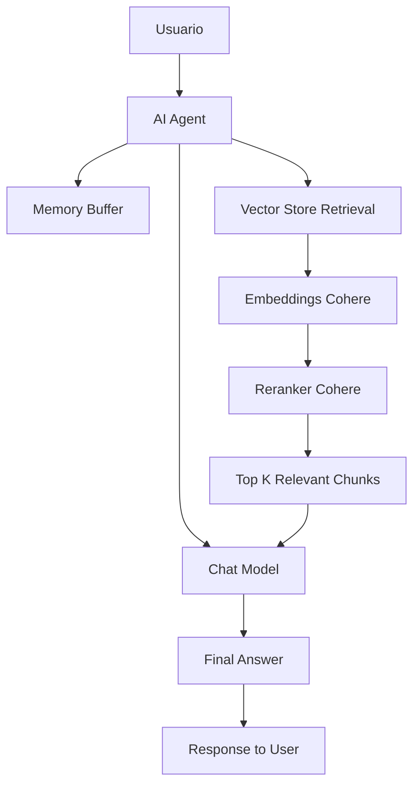
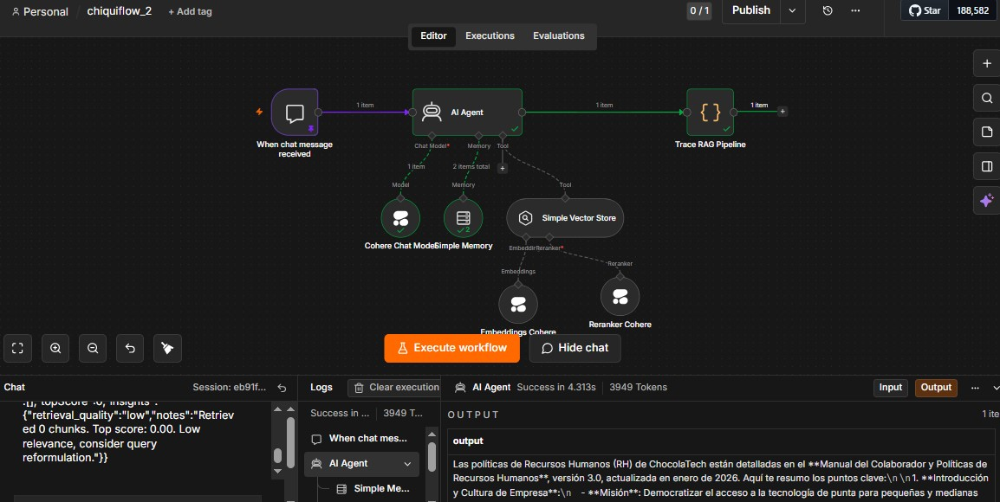

#  1️⃣ Clase 1: El Cerebro del Agente (RAG + Embeddings + n8n)

"Antes de que un agente actúe, debe aprender a pensar. Y antes de pensar… debe aprender a recordar."

--- 

## 🌌 ¿Qué es Chiqui Flow?

Chiqui Flow no es una IA común.

**Una IA común:**

- responde preguntas  
- busca coincidencias  
- improvisa con contexto limitado  

**Un Agente de IA:**

- 🧠 razona  
- 🧭 interpreta intención  
- 📚 consulta memoria estructurada  
- ⚖️ toma decisiones basadas en contexto  
- 🗣️ responde con criterio  

👉 No solo contesta… actúa como un sistema con juicio propio.

--- 

## 🧬 Anatomía del Agente (visión orgánica)

Imagina el sistema como un cuerpo inteligente:

- 🧭 Percepción → recibe la pregunta del usuario  
- 🧠 Interpretación → entiende intención y contexto  
- 📚 Memoria (RAG) → busca conocimiento relevante  
- ⚖️ Decisión → selecciona información útil  
- 🗣️ Respuesta → genera salida coherente  

--- 
## 🧩 Arquitectura del Cerebro del Agente

<div align="center">

### Diagrama de Flujo




</div>

--- 

## 📚 RAG Segmentado — Memoria organizada

El sistema convierte un documento en conocimiento consultable.

Flujo de ingestión:

- 📄 Descarga del Manual de RH desde GitHub
- 🔤 Conversión a embeddings con Cohere
- 🧠 Almacenamiento en Vector Store en memoria

👉 Esto permite búsqueda semántica (no por palabras exactas).

---

## 🏗️ Implementación

### 📊 Flujo 1: Ingestión de Conocimiento

Este workflow se encarga de cargar el Manual de RH de ChocolaTech en el sistema de memoria del agente.

**Componentes:**

- **Manual Trigger**: Inicia el flujo manualmente
- **HTTP Request**: Obtiene el Manual de RH ChocolaTech desde GitHub (GitHub RAW)
  - URL: `https://raw.githubusercontent.com/ericmonne/chocolatech-inmersion-g10/refs/heads/main/Manual%20de%20RH%20ChocolaTech%20LAD.txt`
- **Simple Vector Store**: Almacena los embeddings en memoria
- **Embeddings Cohere**: Genera embeddings usando el modelo `embed-multilingual-v3.0`
- **Default Data Loader**: Procesa y carga los documentos

**Propósito:**

Convertir el documento de texto en conocimiento estructurado que el agente pueda consultar mediante búsqueda semántica.




**Resultado:**

El documento queda indexado como embeddings listos para búsqueda.


## 🤖 Flujo 2: Agente de Consulta

Este workflow implementa el agente de IA que responde preguntas utilizando RAG.

**Componentes:**

- **Chat Trigger**: Recibe mensajes del usuario
- **AI Agent**: Orquesta el proceso de razonamiento
- **Cohere Chat Model**: Modelo de lenguaje para generar respuestas
- **Simple Memory (Buffer Window)**: Mantiene el contexto de la conversación
- **Simple Vector Store Tool (retrieve-as-tool)**: Recupera información relevante (modo retrieve-as-tool)
  - Descripción: "Buscar informaciones sobre RH, asuntos con vacaciones, horarios, etc."
- **Embeddings Cohere**: Genera embeddings para las consultas usando `embed-multilingual-v3.0`

**Propósito:**

Permitir que los usuarios consulten información del Manual de RH de forma natural, con el agente recuperando contexto relevante y generando respuestas coherentes.



**Resultado:**

El agente responde usando el manual de RH como base de conocimiento.

---

## 🧠 Cómo funciona el sistema

### Pregunta del usuario

→ Embedding de la consulta
→ Búsqueda en Vector Store
→ Recuperación de chunks relevantes
→ Envío de contexto al LLM
→ Generación de respuesta

---

## 🧱 Memoria del sistema

El sistema tiene dos capas:

### 📌 1. Memoria semántica (RAG)

- basada en embeddings
- consulta el manual de RH
- no persistente fuera del vector store

### 📌 2. Memoria conversacional

- Buffer Window (Simple Memory)
- mantiene contexto corto de la conversación
- se reinicia por sesión

---

## 🛠️ Tecnologías Integradas

- ⚙️ **n8n (orquestación de flujos)**: Plataforma de automatización para orquestar los flujos
- 🧠 **Cohere**: 
  - **Embeddings**: Modelo de embeddings: `embed-multilingual-v3.0`
  - **Chat Model**: Modelo de chat para generación de respuestas
- 📚 **RAG (Retrieval-Augmented Generation)**: Arquitectura para combinar recuperación de información con generación de lenguaje
- 📖 **Vector Store In-Memory**: Almacenamiento de embeddings para búsqueda semántica.

---

## 🎯 Resultados Obtenidos

### 🧠 Sistema de Memoria Funcional

- Manual de RH indexado correctamente
- Búsqueda semántica operativa en español

### 🤖 Agente conversacional

- Responde preguntas sobre políticas de RH
- Usa el documento como fuente principal
- Mantiene contexto básico de conversación

---

## 🧪 Flujo mental del sistema
```
Pregunta → Interpretar → Buscar → Contextualizar → Responder
```

--- 

## 🔥 Principios clave del sistema

- No inventar información
- Priorizar el contenido del documento
- Usar contexto recuperado como fuente de verdad
- Responder de forma clara y estructurada

---

## 📚 Recursos

- n8n → https://n8n.io
- Manual RH CHOCOLATECH → (base de conocimiento del sistema)
- Cohere → https://cohere.com
- GitHub CHOCOLATECH → repositorio del conocimiento

---

## 📊 Estado del Sistema (Opcional)

Esta sección describe capacidades avanzadas del sistema que no son obligatorias para el funcionamiento básico del RAG, pero elevan el proyecto a un nivel de observabilidad y arquitectura profesional.

### 🧠 Capacidades ya implementadas

El sistema actual cuenta con los siguientes componentes activos:

- **RAG funcional** ✔️
El sistema es capaz de recuperar información relevante desde un vector store basado en el Manual de RH de ChocolaTech y usarla como contexto para responder.
- **Reranking real** ✔️
Se utiliza el modelo rerank-multilingual-v3.0 de Cohere para ordenar los chunks por relevancia real, mejorando la calidad del contexto final.
- **Filtrado inteligente** ✔️
Los chunks con baja relevancia (score < 0.4) son descartados automáticamente, evitando ruido en la generación de respuestas.
- **Trazabilidad del razonamiento** ✔️
El sistema registra el proceso completo de recuperación, ranking y selección de información, permitiendo inspeccionar cómo “pensó” el agente antes de responder.

### Qué habilita esto en el sistema

Estas capacidades permiten que el agente no solo responda preguntas, sino que:

- Muestre evidencia de cómo llegó a una respuesta
- Permita depurar la calidad del retrieval
- Mejore progresivamente la precisión del RAG
- Se comporte como un sistema observables tipo LangSmith / OpenAI Traces

---

## 🏗️ Diagrama actual del sistema

<div align="center">




</div>

---

### Agent + Vector Store + Reranker + Memory




---

### 📋 EXPLICACIÓN DEL SISTEMA

🟢 **1. Entrada**

El usuario envía una pregunta por chat.

🟡 **2. Agente (cerebro central)**

El AI Agent coordina:

- memoria
- retrieval
- LLM
- herramientas

⚪ **3. Recuperación (RAG)**

El Vector Store:

- convierte texto en embeddings
- busca chunks relevantes

🔴 **4. Reranking (tu upgrade clave)**

Cohere reranker:

- Ordena chunks por relevancia real
- elimina ruido semántico

🟣 **5. Context assembly**

El agente construye contexto final limpio.

🔵 **6. Generación**

El LLM genera la respuesta final usando solo contexto relevante.

🟠 **7. Observabilidad (lo que estás construyendo ahora)**

Aunque no es UI todavía, ya existe:

- scores de chunks
- ranking
- trazas del retrieval
- logs del flujo de decisión

👉 Esto es la base del “LangSmith que estás simulando”

Es esto:

📊 “Agente con memoria + recuperación + ranking + trazabilidad”

