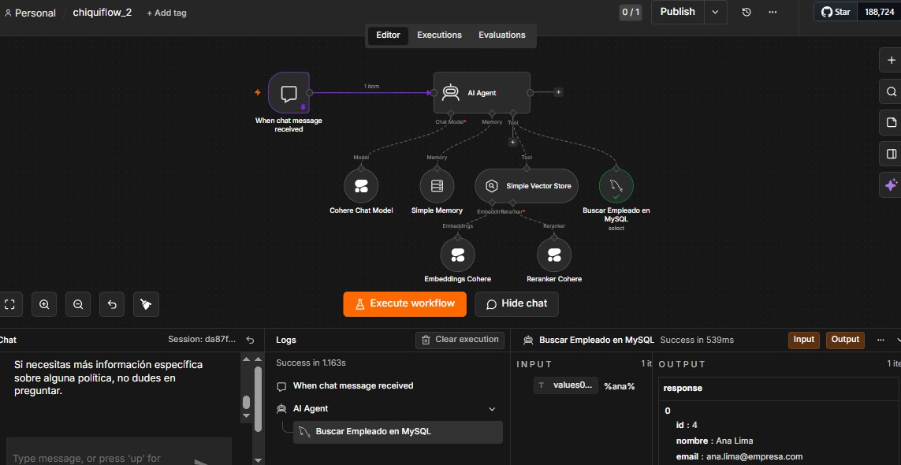

# 🚀 Clase 2 – Memoria y Datos
## Integración de IA con MySQL

En esta clase construimos algo que ya empieza a verse como un sistema profesional:
un Agente de IA conectado a MySQL, capaz de buscar empleados dinámicamente usando consultas parciales con LIKE 🧠⚡

## 🎯 Objetivo de la Clase

Crear un flujo donde:

- El usuario escribe en el chat.
- El AI Agent interpreta la intención.
- Se ejecuta una consulta en MySQL.
- Se devuelven datos reales del empleado.
- La búsqueda se hace usando formato parcial %nombre%.

## 🏗 Arquitectura del Flujo

<div style="text-align: center;">

```
When Chat Message Received
    ↓
    AI Agent
   (Modelo + Memoria)
    ↓
Tool: Select rows from MySQL
    ↓
Respuesta estructurada
```
</div>

## 🧠 Componentes Utilizados

1️⃣ When Chat Message Received

Disparador del flujo.
Recibe el mensaje del usuario y activa el agente.

2️⃣ AI Agent

Configurado con:

✅ Cohere Chat Model
✅ Simple Memory
✅ Tool: Select rows from MySQL
✅ (Opcional) Vector Store

El agente es quien decide cuándo usar la herramienta MySQL.

3️⃣ Tool: Select Rows from a Table in MySQL

Aquí está la clave de la clase.

### 🔎 Configuración importante:

**Condición:**
```
LIKE
```

**Value:**
```
Definido automáticamente por el modelo
```

**Descripción:**
```
Usar siempre el formato %nombre% para búsqueda parcial.
Por ejemplo: %Eric Monne%.
```

## 📸 Implementación del Workflow



## 💡 ¿Por qué usar `%nombre%`?

En MySQL:

```
LIKE '%juan%'
```

Significa:

- Que contenga "juan"
- Puede estar al inicio, medio o final

Si NO usamos los `%`, MySQL buscará coincidencia exacta.

Y aquí viene el detalle fino 👇

## ⚠ El Problema Más Común

Si escribes en el chat:

```
Juan
```

Pero el modelo no genera:

```
%Juan%
```

Entonces la consulta no devuelve resultados.

👉 Por eso en la configuración se obliga al modelo a usar siempre %nombre%.

Pero ojo… Si el usuario tiene que escribir manualmente `%juan%`, entonces el agente no está haciendo su trabajo correctamente. La IA debería encargarse de eso.

## 🧪 Ejemplo de Funcionamiento Correcto

**Usuario escribe:**
```
Buscar empleado Juan
```

**El AI Agent genera internamente:**
```
LIKE '%Juan%'
```

**MySQL devuelve:**
```json
{
  "id": 4,
  "nombre": "Ana Lima",
  "email": "ana.lima@empresa.com",
  "departamento": "Marketing",
  "puesto": "Especialista en Marketing",
  "fecha_ingreso": "2020-11-05",
  "saldo_vacaciones": 15,
  "banco_horas": -4.0,
  "modalidad": "remoto"
}
```

Y el agente responde en lenguaje natural.

Eso es integración bien hecha. 👏

## 🧠 Rol de la Memoria

La Simple Memory permite que:

- El agente recuerde el contexto
- Mantenga coherencia en la conversación
- No pregunte lo mismo varias veces

**Ejemplo:**

**Usuario:**
```
¿Y en qué departamento está?
```

El agente ya sabe de qué empleado se está hablando.

Eso ya es comportamiento inteligente real.

## 🛠 Buenas Prácticas

- ✔ Forzar formato `%nombre%` desde la descripción
- ✔ No depender del usuario para escribir comodines
- ✔ Probar consultas directamente en MySQL primero
- ✔ Verificar que el campo correcto tenga LIKE
- ✔ Revisar el panel de logs del workflow

## 🔎 Checklist de Validación

Antes de publicar:

- ¿El tool está conectado al AI Agent?
- ¿El Value está "Defined automatically by the model"?
- ¿La descripción menciona el uso de `%nombre%`?
- ¿Funciona sin que el usuario escriba `%`?
- ¿Los logs muestran el parámetro correcto?

## 📌 Resultado Final Esperado

Un chat donde el usuario pueda escribir:

- "Buscar empleado Ana"
- "Datos de Lima"
- "Información de Marketing"

Y el sistema responda con datos reales desde MySQL, sin que el usuario tenga que saber qué es `LIKE`, ni `%`, ni SQL.

Porque la complejidad debe estar detrás del telón. Como siempre ha sido en los buenos sistemas.