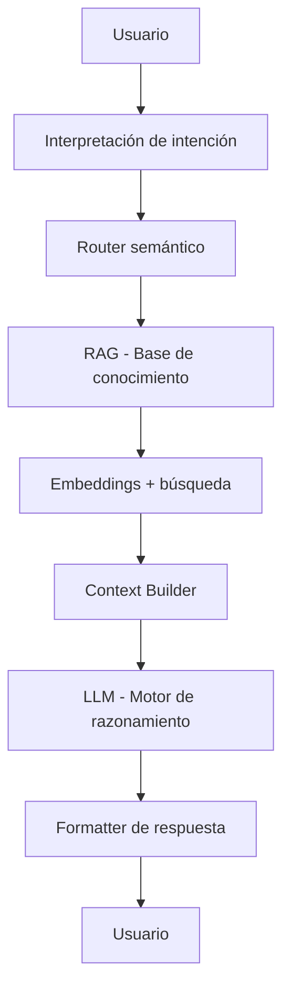

# 🌌 Imersión Alura — Construye Agentes de IA desde Cero

"La tecnología cambia cuando dejamos de aprender herramientas… y empezamos a construir sistemas que piensan."

---

## 🧭 ¿Qué es esta inmersión?

La Imersión Alura es una experiencia intensiva y práctica donde pasas de:

👶 Usuario de IA
→ a
🧠 Constructor de agentes inteligentes

---

## ⚙️ Qué vas a construir

Durante la inmersión aprenderás a diseñar un sistema basado en:

### 🧠 1. Agentes de IA (no chatbots)

- entienden intención.
- consultan memoria.
- ejecutan lógica.
- responden con criterio.

### 📚 2. RAG (Retrieval-Augmented Generation)

Transformas documentos en conocimiento vivo:

- fragmentación inteligente.
- embeddings.
- búsqueda semántica.
- recuperación contextual.

👉 El conocimiento deja de ser archivo
👉 y se vuelve memoria activa

### 🔤 3. Embeddings

Aprendes a convertir texto en significado matemático:

- similitud semántica.
- búsqueda inteligente.
- contexto relevante.

### 🔄 4. Flujos de ingestión de datos

Construyes el pipeline mental del sistema:

- cargar datos.
- procesar información.
- estructurar conocimiento.
- prepararlo para consulta.

### 🧩 5. Arquitectura de agentes en n8n

Diseñas flujos donde la IA:

- interpreta preguntas.
- consulta memoria.
- decide rutas.
- genera respuestas.

### 🗣️ 6. Interacción real (Telegram bot)

Creas una interfaz humana:

- conversación natural.
- acceso directo al agente.
- experiencia tipo asistente real.

---

## 🧬 Arquitectura mental del sistema

<div align="center">



</div>

---

## ⚖️ La diferencia clave

### 🤖 IA común
- responde preguntas.
- improvisa con contexto limitado.
- no tiene memoria real.

### 🧠 Agente de IA
- entiende intención.
- consulta conocimiento estructurado.
- mantiene coherencia.
- puede integrarse con herramientas.
- razona antes de responder.
---

## 🧭 Tecnologías que usarás

- 🧠 Modelos de IA (OpenAI / Cohere / Gemini según el enfoque).
- 📚 Embeddings.
- ⚙️ n8n (automatización).
- ☁️ Railway (infraestructura).
- 💬 Telegram (interfaz de usuario).
---

## 🧪 Qué aprenderás en la práctica

- qué es realmente RAG (sin humo).
- cómo construir memoria para IA.
- cómo transformar documentos en sistemas inteligentes.
- cómo diseñar flujos de automatización reales.
- cómo estructurar un agente desde cero.
---

## 🚀 Flujo conceptual de un agente
```
Pregunta → Interpretación → Búsqueda → Contexto → Razonamiento → Respuesta
```

Simple en idea, complejo en ingeniería.

---

## 🧠 Filosofía de la inmersión

Antes, aprendíamos herramientas, hoy construimos sistemas que usan herramientas por nosotros. Esto marca un cambio silencioso: de ejecutar tareas a diseñar inteligencia operativa.

---

## 🌱 Lo que realmente estás construyendo

No es un bot, ni un flujo.

Es: un sistema que convierte conocimiento en acción estructurada.

## Resumen de la Inmersión

- **Objetivo**: Construir un agente de IA que pueda entender preguntas, buscar información relevante y generar respuestas coherentes.
- **Tecnologías**: OpenAI, Cohere, Gemini, n8n, Railway, Telegram.
- **Flujo**: Usuario → Interpreta intención → Router semántico → RAG → Embeddings → Búsqueda → Contexto → LLM → Formatea respuesta → Usuario.
- **Diferencia**: IA común responde preguntas, agente de IA entiende intención, consulta conocimiento estructurado, mantiene coherencia y puede integrarse con herramientas.
- **Práctica**: Construir memoria para IA, transformar documentos en sistemas inteligentes, diseñar flujos de automatización reales, estructurar un agente desde cero.
<div align="center">


</div>

---

Esta inmersión no trata de aprender IA. Trata de algo más profundo: aprender a construir inteligencia que trabaja contigo.